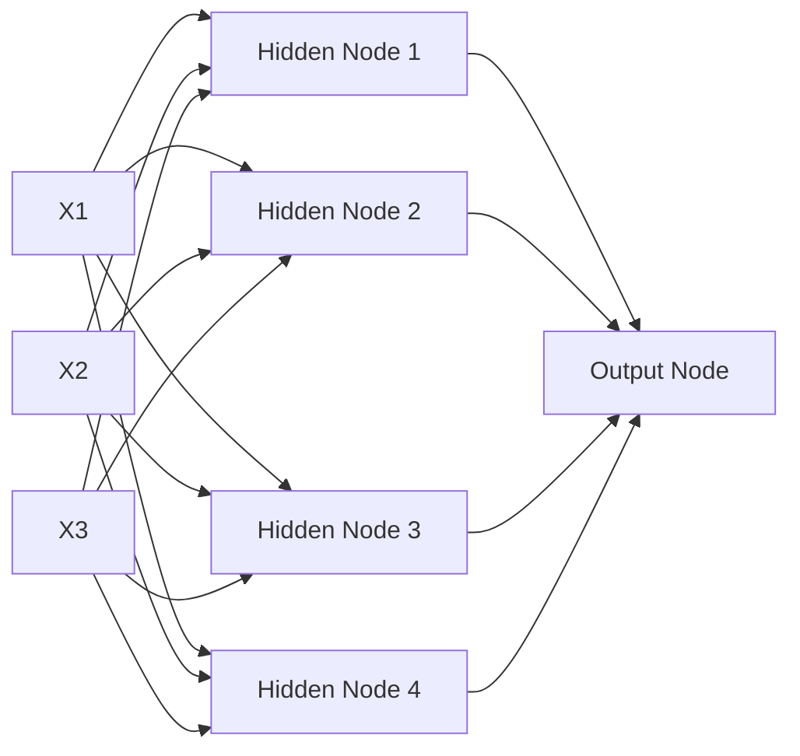

# Neural Network Representation

Think of a simple diagram representing a neural network using nodes and connections (1 input layer and 1 hidden layer and 1 output layer). We may have 3 features (input), 4 nodes within the hidden layer, and 1 node in the output layer. 
* Input layer: 3 input features such as x1, x2, x3, etc.
* Hidden layer: 4 nodes such as h1, h2, h3, h4
* Output layer: 1 node representing the final prediction y 

Please understand that the hidden layer only has ONE single layer made of 4 neurons, e.g., w = [4,3] and b = [4,1]. However, networks can have multiple hidden layers, and this is just an example with one hidden layer that helps me learn easier. 

I am using one example as my learning process from this link below but also replace the numbers with my own random numbers and a different scenario:

https://becominghuman.ai/understanding-the-structure-of-neural-networks-1fa5bd17fef0

### ALERT: Creating a Diagram in GitHub Using Mermaid 

I just learned that I can use mermaid to create a diagram in this platform without using an external platform! Here's the cool stuff here below. 

### How do we identify neural network equations? 

